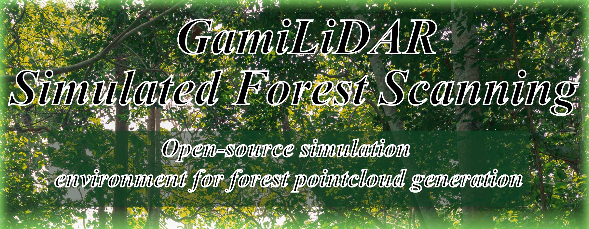

Test and develop AR games for the GamiLiDAR application on a desktop computer without an ARKit device.

## Features

- Develop or test either new or pre-existing AR games of the GamiLiDAR application
- Test the AR games in a pseudo-randomly generated, configurable forest environment
- Simulate the point cloud scanning that the core application does with LiDAR hardware
- Visualize scanned points in the simulation in real time
- Simulate the AR mesh that the core application creates and utilizes
- Save point cloud and camera movement data to disk in a format identical to the core application

## Getting started

### Install dependencies

- Install Unity Hub from https://unity.com/download

- Install Unity 6 LTS **6000.0.35f1** from https://unity.com/releases/editor/archive

### Clone this repository

Clone this repository to your machine using your favorite Git client.

## Usage

Open Unity Hub, navigate to `Projects -> Add -> Add project from disk` and add the repo you cloned.

Click on the project in Unity Editor and start development!

## Porting games

The existing spider game from the GamiLiDAR core application has been ported on to the simulation, with the porting process being documented into its own document. 
The port has been done onto the branch "25_spider_game_port". This should function as an example of how to port AR games onto the simulation environment.

The project group has also developed a UFO shooting game as a POC of using the simulation for AR game development. The UFO game was succesfully ported onto the
GamiLiDAR core application by the group, and the porting process was documented similarily to the spider game port.

## Continuous Integration (CI)

The pipeline builds the project and executes Edit Mode as well as Play Mode tests.

The project's CI pipeline is based on the templates and containers provided by [GameCI](https://game.ci/docs/gitlab/getting-started/). The pipeline requires few environment variables to be set in the repo settings for Unity activation: https://game.ci/docs/gitlab/activation#personal-license

Runners should have proper caching, as otherwise incremental builds take half an hour instead of few minutes.

[Doxygen](https://www.doxygen.nl/) is used for compiling XML-style code documentation via the CI pipeline. The generated PDF file can be found [here](https://gitlab.tuni.fi/api/v4/projects/1416/jobs/artifacts/main/raw/Documentation/latex/simulated-forest-scanning_docs.pdf?job=generate-doxygen-pdf).

## License

To be determined, possibly MIT.
